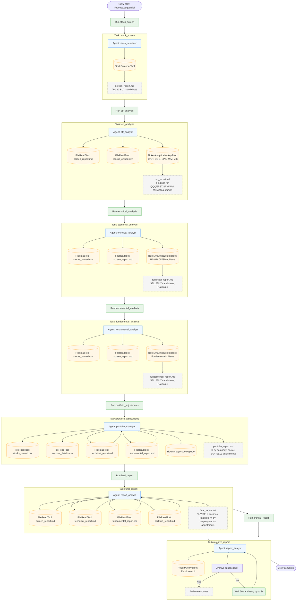

## Agentic Workflow Diagram

This diagram shows how agents, tasks, tools, and report artifacts flow through the sequential CrewAI run defined in `crew.py` with config from `config/agents.yaml` and `config/tasks.yaml`.

Notes:
- Execution is sequential in the order defined in `crew.py` (stock_screen → etf_analysis → technical_analysis → fundamental_analysis → portfolio_adjustments → final_report → archive_report).
- FileReadTool instances for reports and CSVs resolve paths using the `LOCAL_DATA_DIR` environment variable from `.env`.
- The archive step retries up to 3 times with a 30-second delay if the first attempt fails.
